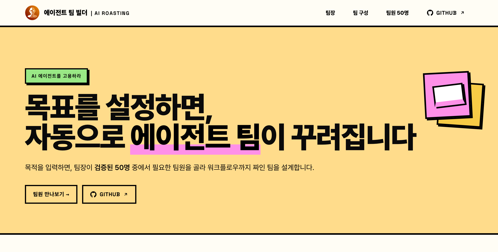

# Casting · Agent Team Builder

[한국어](./README.md) · **English**


[](https://50agents.airoasting.com)

[](https://50agents.airoasting.com)

> Say what you want in one line and it picks a team from the 50 members. It then **actually runs that team** and hands back work that passed review. It is a Claude Code skill.

**Live demo**: [50agents.airoasting.com](https://50agents.airoasting.com). Browse the 50-member catalog and the team builder right in the browser.

## Why it exists

Even one report passes through several hands. One person gathers the material, another reads the numbers, another writes it up, another finds what is wrong. Hand that work to AI and one model usually does all of it alone. It reviews its own writing, so the wrong parts stay in.

Casting splits the work. Each member is a different agent, and the reviewer is someone who did not produce the deliverable. You only say what you want made. The team lead decides who does it and in what order, then carries it to the end.

Inside are 50 role prompts and 28 team recipes.

## How it runs

| Step | What happens |
|---|---|
| ① Read the goal | What gets made, who it is for, whether the material exists. If it does not, it asks first. |
| ② Design the team | It picks a recipe or assembles fresh members. The same input gives the same team. |
| ③ Show the team | You see who does what, in what order, before anything runs. |
| ④ Execute | Each member comes up as its own agent. Steps that do not touch each other run at once. |
| ⑤ Review | The reviewer looks for defects first. Below 9.5, the work goes back one step. |

There are three layers.

- **50 agent members**. Each is a system prompt for one role.
- **28 recipes**. Each is a team with the members already chained. Research reports, market analysis, financial review, decks, strategy, meeting wrap-ups, and more.
- **The router**. It takes the goal, picks a recipe, or assembles a fresh set of members. This is the heart of the skill.

**It works best in Claude Code.** Each member runs as its own agent and the reviewer comes up separately. That is where the 9.5 gate bites hardest. You can also use it in ChatGPT, where one model takes the roles in turn.

## The 50 agent members

Teams are drawn from the 50 roles below. They are split into **10 divisions**, the way a company is, and the numbers follow the division order.

> The faces on the site and in this document are **fictional people made with ChatGPT**. They are not real people.

### 1. Strategy Office
| # | Role | Korean | What they do |
|---|---|---|---|
| 1 | Management Strategist | 경영전략가 | Designs company-wide and competitive strategy and market positioning |
| 2 | New Business Developer | 신규사업 개발 | Finds new business opportunities and designs the business model |
| 3 | Feasibility Analyst | 사업 타당성 분석가 | Validates feasibility through profitability and risk |
| 4 | Product Manager | 제품 기획자 | Turns requirements and roadmap into a PRD |
| 5 | Project & OKR Planner | 프로젝트·목표 기획자 | Designs execution plans, schedules and OKRs |

### 2. Research Lab
| # | Role | Korean | What they do |
|---|---|---|---|
| 6 | Research Assistant | 리서치 어시스턴트 | Researches a topic and organizes the essentials |
| 7 | Fact & Source Checker | 팩트·출처 검증가 | Verifies claims and figures against their sources |
| 8 | Market Researcher | 마켓 리서처 | Researches markets and industry trends |
| 9 | Competitor Analyst | 경쟁·동향 분석가 | Analyzes competitors and comparable cases |
| 10 | Data Analyst | 데이터 분석가 | Finds patterns and insight in data |
| 11 | Trend & Insight Analyst | 트렌드·인사이트 분석가 | Reads the direction of travel and names the insight |

### 3. Marketing Division
| # | Role | Korean | What they do |
|---|---|---|---|
| 12 | Content Marketer | 콘텐츠 마케터 | Plans organic content topics and narrative |
| 13 | SEO & GEO Strategist | SEO·GEO 전략가 | Optimizes for search and AI visibility |
| 14 | Social Media Strategist | 소셜미디어 전략가 | Runs channels and builds the content calendar |
| 15 | Performance Ad Strategist | 퍼포먼스·광고 전략가 | Designs paid media and conversion |
| 16 | Copywriter | 카피라이터 | Sharpens ad and sales copy |
| 17 | Email & CRM Marketer | 이메일·CRM 마케터 | Designs newsletters and retention |
| 18 | VOC & Survey Analyst | VOC·설문 분석가 | Analyzes customer voice and survey data |

### 4. Design Division
| # | Role | Korean | What they do |
|---|---|---|---|
| 19 | Slide Designer | 슬라이드 디자이너 | Generates presentation visuals |
| 20 | Infographic Designer | 인포그래픽·차트 디자이너 | Visualizes data |
| 21 | Card News Creator | 카드뉴스 제작자 | Produces social card news |
| 22 | Brand & Visual Guardian | 브랜드·비주얼 가디언 | Protects tone, identity and visuals |
| 23 | Image Generator | 이미지 생성 | Generates the images a piece needs |
> The five design roles write prompts with gpt-image and produce real image files through the OpenAI image API. Without an API key they generate the finished prompt only.

### 5. Content Production Division
| # | Role | Korean | What they do |
|---|---|---|---|
| 24 | Report Writer | 보고서 작성가 | Drafts reports |
| 25 | Proposal & Grant Writer | 제안서·지원사업 작성가 | Writes proposals and grant applications |
| 26 | Business Correspondence Writer | 이메일·업무 서신 작성 | Writes business email and letters |
| 27 | Summarizer | 요약·브리핑 담당 | Reduces long documents to the core |
| 28 | Copy Editor | 교정·윤문 담당 | Polishes and proofreads prose |
| 29 | Translator | 번역·현지화 담당 | Translates and makes it read naturally |

### 6. Communications & PR Division
| # | Role | Korean | What they do |
|---|---|---|---|
| 30 | PR & Media Relations | PR·언론 홍보 | Handles press releases and media response |
| 31 | Customer Response | 대외 응대 | Writes replies to inquiries and complaints |
| 32 | Internal Comms | 사내 커뮤니케이션 | Writes internal announcements and guidance |
| 33 | Speech Writer | 발표·스피치 작성 | Writes talks and speeches |
| 34 | Negotiation & Stakeholder | 협상·이해관계자 대응 | Prepares negotiation scenarios |

### 7. Finance Division
| # | Role | Korean | What they do |
|---|---|---|---|
| 35 | Financial Analyst | 재무 분석가 | Reads financial statements and models scenarios |
| 36 | Budget & Cost Manager | 예산·비용 관리 | Builds budgets and examines cost structure |
| 37 | Investor Reporter | IR·투자자 리포트 | Writes investor and board reporting |
| 38 | KPI Tracker | KPI 추적 | Tracks and organizes core metrics |
| 39 | Risk Analyst | 리스크 분석가 | Identifies and assesses financial and business risk |
| 40 | Certified Accountant | 회계사 | Assists with tax and accounting treatment |

### 8. HR Division
| # | Role | Korean | What they do |
|---|---|---|---|
| 41 | Recruiter | 채용 담당 | Prepares job posts and interview questions |
| 42 | Labor Attorney | 노무사 | Assists with HR, employment and labor matters |
| 43 | Comp & Performance Designer | 성과·보상 설계 | Designs evaluation and compensation systems |

### 9. Legal & Audit Office
| # | Role | Korean | What they do |
|---|---|---|---|
| 44 | Legal Counsel | 변호사 | Reviews contracts and legal risk |
| 45 | Auditor | 감사인 | Checks internal audit, compliance and controls |
| 46 | Document & Quality Reviewer | 문서·품질 검수 | Inspects contracts, documents and deliverables |
| 47 | Devil's Advocate | 비판적 검토자 | Attacks the conclusion to find its weak points |
> The accountant, legal counsel, auditor and labor attorney help with drafts and a first pass. They are not legal, tax or labor advice. Check the final call with a licensed professional.

### 10. Operations & Automation Division
| # | Role | Korean | What they do |
|---|---|---|---|
| 48 | SOP & Process Designer | 프로세스 설계자 | Documents standard operating procedures |
| 49 | Automation Architect | 자동화 설계자 | Automates repetitive work and reporting |
| 50 | Work & Schedule Orchestrator | 업무·일정 조율가 | Coordinates schedules, tasks and mail |

> The team lead (orchestrator) is not one of the 50. It picks the members, sets the order, and runs execution and review.

## Install

Clone the repository and copy only the skill files into your Claude Code skills folder. The skill files sit at the repository root. The demo site sits in `docs/`.

```bash
git clone https://github.com/airoasting/casting.git
# For every project, install at user level (~/.claude/skills)
mkdir -p ~/.claude/skills/casting
cp -r casting/{SKILL.md,README.md,LICENSE,NOTICE,references,platforms,scripts} ~/.claude/skills/casting/
```

For one project only, copy to `<your-project>/.claude/skills/casting` instead. Restart Claude Code and you can call it with `/casting`.

## Usage

```
/casting Analyze three competitors and build a board-level report
```

"Put a team on this" works too, and so does asking for a report, an analysis, a deck, a proposal, a financial review or a meeting wrap-up. You do not need to know who is required.

It is not for one-line edits, simple lookups or arithmetic. Use it when the work needs several hands.

## Execution modes

Pick the highest mode the available tools allow.

1. **Agent teams**. This is for when `TeamCreate`, `SendMessage` and `TaskCreate` are available. Members coordinate themselves through a shared task list.
2. **Subagents**. The `Agent` tool alone is enough. Steps that follow each other run in order, and steps that do not touch each other run at once. This is the default.
3. **Sequential role-play**. Use this only when no agent tooling exists at all. The lead takes the roles in turn.

What matters is that each member holds **its own context**. So the reviewer never scores its own writing. Unrelated steps run side by side.

## Quality gate

The reviewer is a **separate agent that did not write the deliverable**. It goes back to the user's original goal and source material and looks for defects first. One defect is enough to withhold 9.5, and the work goes back a step. After one round of rework it gets read again.

Scoring runs on five axes: accuracy and evidence, purpose and completeness, structure and format, actionability, language and tone. If any single axis falls below 9.0, the work fails no matter what the average says. A gap left by missing material is never papered over as a finished piece; it comes back with a note on what is still needed.

## Execution artifacts (workspace)

Run it in Claude Code and the team and its outputs stay on disk.

```
_workspace/
└── 20260628_01/             # {YYYYMMDD}_NN, _02 and _03 for repeat runs the same day
    ├── team.md              # build sheet: goal, team structure, order, toggles
    ├── lead/                # team lead (orchestrator)
    │   └── lead.md
    ├── agents/              # staffed members (role prompt + this run's io)
    │   ├── 1-research-assistant.md
    │   ├── 2-summarizer.md
    │   └── review-copy-editor.md
    └── output/              # per-step outputs + final result
```

The team does not disappear after one use. You can open it again later or reuse it as it is.

## Using it in ChatGPT (compatibility mode)

Claude Code is the default, but the same behavior runs as a **ChatGPT Custom GPT**. Setup sits in `platforms/chatgpt/`.

- `platforms/chatgpt/INSTRUCTIONS.md`. The body to paste into the Custom GPT Instructions field.
- `platforms/chatgpt/SETUP.md`. A five-minute setup. Paste the instructions. Upload the four `references/` files as Knowledge. Turn browsing on.

The Custom GPT builder has no subagents. So one model runs the roles in order, and the gate works as a cold second read. The 50 members, the 28 recipes and the 9.5 gate are the same.

Since GPT-5.6, ChatGPT Work and Codex do support subagents, spawning several agents at once and collecting their results. Running it there gets you parallel execution close to Claude Code, but the Custom GPT builder is not covered yet, so this setup assumes sequential mode.

## Equipped tools

Some members carry tools AI ROASTING built, one per role.

| Tool | Purpose | Members who get it |
|---|---|---|
| [Strategy tool gallery](https://airoasting-strategy.vercel.app/) | 70 consulting frameworks | Management strategist, new business, feasibility |
| [5color](https://5color.vercel.app/) | Generates five-persona review guidance | Document & quality review, devil's advocate, copy editor |
| [Slide library](https://airoasting-slide.vercel.app/) | 35 HTML slide templates | Slide design, proposals |
| [AI ROASTING blog](https://airoasting-blog.vercel.app/) | Global research insight | Research, trends, market |
| [Hound](https://github.com/airoasting/hound) | Relentless multi-channel search across 16 channels | Research, fact-check, market, competitor analysis, source verification |
| [Skill library](https://airoasting-skill.vercel.app/) | Curated practical AI skills | Automation architect, process design |
| [FSS filings search skill (`/dart`)](https://github.com/airoasting/dart) | Pulls Korean DART filings into an interactive analyst HTML report (13 investor personas) | Financial analyst, IR, accountant, feasibility |

## Repository layout

Skill files sit at the repository root, and the demo site sits in `docs/`. That folder is served both by GitHub Pages and at the live domain [50agents.airoasting.com](https://50agents.airoasting.com).

```
SKILL.md                   # triggers · router decision ladder · execution protocol · 9.5 gate
README.md                  # Korean README
README.en.md               # this document
LICENSE                    # Apache License 2.0
NOTICE                     # third-party fonts and icons, quotation source, generated-image disclosure
references/                # generated from docs/assets by scripts/sync_refs.py (do not hand-edit)
├── catalog.md             # the 50-member selection table
├── harnesses.md           # 28 recipes + router decision ladder + toggles
├── agent-prompts.md       # full system prompts for all 50 (selected by id range)
└── execution-modes.md     # the three execution modes · real tool-call syntax · reviewer template
scripts/
├── sync_refs.py           # regenerates references/ from the site source of truth (--check to verify)
└── gen_image.py           # real image output for the design roles
platforms/
└── chatgpt/
    ├── INSTRUCTIONS.md    # Custom GPT instructions body
    └── SETUP.md           # ChatGPT setup guide
docs/                      # demo site · source of truth for data
├── index.html            # team builder · 50-member catalog · A array (role source of truth)
└── assets/               # prompts.js (prompt source) · router.js (recipe source) · agents · logos
```

## Changelog

**v1.1.1 (2026-08-15)**
Role numbers now live in one place. `scripts/sync_refs.py` builds `references/`. Added the generated-image disclosure, third-party credits (`NOTICE`), and this English README.

**v1.1.0 (2026-07-12)**
Reorganized into 10 divisions, the way a company is. Added design, marketing, legal, audit and HR roles, and design roles now produce real images.

**v1.0.0 (2026-06-28)**
Designed the 50-member structure and shipped the first release.

## License

Copyright 2026 AI ROASTING (Jayden Kang). Released under the [Apache License 2.0](./LICENSE).

Third-party fonts and icons, the quotation source, and the generated-image disclosure are listed in [NOTICE](./NOTICE).
