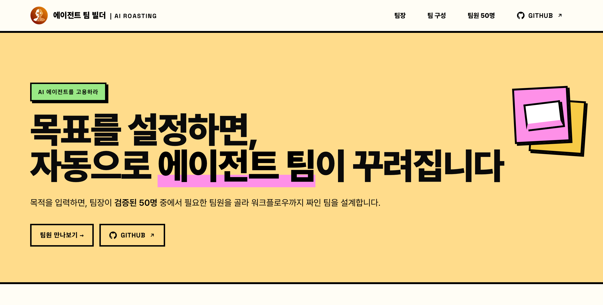

# Casting · Agent Team Builder

[한국어](./README.md) · **English**


[](https://50agents.airoasting.com)

[](https://50agents.airoasting.com)

Tell it what you want and the orchestrating team lead picks the agents it needs from the 50, assembles a team, then **actually runs that team** and produces work that carries an independent reviewer's verdict.

**Live demo**: [50agents.airoasting.com](https://50agents.airoasting.com). Browse the 50-member catalog and the team builder right in the browser.

## Why it exists

Even one report passes through several hands. One person gathers the material, another reads the numbers, another writes it up, another finds what is wrong. Hand that work to AI and one model usually does all of it alone. A model grading its own writing goes easy on itself.

Casting splits the work. Each member is a different agent, and the reviewer is someone who did not produce the deliverable. You only say what you want made. The team lead decides who does it and in what order, then carries it to the end.

Inside are 50 role prompts and 28 prebuilt teams.

## How it runs

| Step | What happens |
|---|---|
| ① Read the goal | What gets made, who it is for, whether the material exists. If it does not, it asks first. |
| ② Design the team | It picks a prebuilt team or assembles fresh members. The same input gives the same team. Then it writes a spec for each deliverable with a length cap and required elements. Writers and the reviewer get the same spec. |
| ③ Show the team | You see who does what, in what order, before anything runs. |
| ④ Execute | Each member comes up as its own agent. Steps that do not touch each other run at once. |
| ⑤ Review | The reviewer looks for defects first. Below 9.5, the work goes back one step once. If it still falls short, it ships marked "below bar" with the remaining defects listed. |

There are three layers.

- **50 agent members**. Each is a system prompt for one role, and every one follows the same six sections (Role · Rubric · Workflow · Tools · Context · Guardrail).
- **28 prebuilt teams**. Each has its members already chained. Research reports, market analysis, financial review, decks, strategy, meeting wrap-ups, and more.
- **The router**. It takes the goal, picks a prebuilt team, or assembles a fresh set of members. This is the heart of the skill.

**It works best in Claude Code.** Each member runs as its own agent and the reviewer comes up separately. That is where the 9.5 gate bites hardest. The same files also install into Codex CLI.

## The 50 agent members

Teams are drawn from the 50 roles below. They are split into **10 divisions**, the way a company is, and the numbers follow the division order.

Every member's system prompt uses the same six sections.

| Section | What it holds |
|---|---|
| **Role** | Identity, what it does and does not do (naming neighboring roles by number), when it is done, its judgment rule |
| **Rubric** | Output format, a check question for every output item, 8 / 9 / 9.5 / 10 point anchors, an example |
| **Workflow** | Steps that build the output, a self-check step, who it hands off to |
| **Tools** | Tools it can actually use and what for, and what to do without them |
| **Context** | What it receives, required inputs, defaults when inputs are missing, the reader. It asks in a chat with a person and proceeds on defaults inside a team |
| **Guardrail** | Only the role's real risks. Unknown values are [확인 필요], inferences 추정, premises 가정, open decisions 미정, values the team set (제안) |

The same prompt works copied from the site for solo use or launched as a member inside casting. The standard and its 10-point criteria live in `references/role-template.md`.

### 1. Strategy Office
| # | Role | Korean | What they do |
|---|---|---|---|
| 1 | Management Strategist | 경영전략가 | Designs company-wide and competitive strategy and market positioning |
| 2 | New Business Developer | 신규사업 개발 | Finds new business opportunities and designs the business model |
| 3 | Feasibility Analyst | 사업 타당성 분석가 | Validates feasibility through profitability and risk |
| 4 | Product Manager | 제품 기획자 | Turns requirements and roadmap into a PRD |
| 5 | Project & OKR Planner | 프로젝트·목표 기획자 | Designs execution plans, schedules and OKRs |

### 2. Research Lab
| # | Role | Korean | What they do |
|---|---|---|---|
| 6 | Research Assistant | 리서치 어시스턴트 | Researches a topic and organizes the essentials |
| 7 | Fact & Source Checker | 팩트·출처 검증가 | Verifies claims and figures against their sources |
| 8 | Market Researcher | 마켓 리서처 | Researches markets and industry trends |
| 9 | Competitor Analyst | 경쟁·동향 분석가 | Analyzes competitors and comparable cases |
| 10 | Data Analyst | 데이터 분석가 | Finds patterns and insight in data |
| 11 | Trend & Insight Analyst | 트렌드·인사이트 분석가 | Reads the direction of travel and names the insight |

### 3. Marketing Division
| # | Role | Korean | What they do |
|---|---|---|---|
| 12 | Content Marketer | 콘텐츠 마케터 | Plans organic content topics and narrative |
| 13 | SEO & GEO Strategist | SEO·GEO 전략가 | Optimizes for search and AI visibility |
| 14 | Social Media Strategist | 소셜미디어 전략가 | Runs channels and builds the content calendar |
| 15 | Performance Ad Strategist | 퍼포먼스·광고 전략가 | Designs paid media and conversion |
| 16 | Copywriter | 카피라이터 | Sharpens ad and sales copy |
| 17 | Email & CRM Marketer | 이메일·CRM 마케터 | Designs newsletters and retention |
| 18 | VOC & Survey Analyst | VOC·설문 분석가 | Analyzes customer voice and survey data |

### 4. Design Division
| # | Role | Korean | What they do |
|---|---|---|---|
| 19 | Slide Designer | 슬라이드 디자이너 | Generates presentation visuals |
| 20 | Infographic Designer | 인포그래픽·차트 디자이너 | Visualizes data |
| 21 | Card News Creator | 카드뉴스 제작자 | Produces social card news |
| 22 | Brand & Visual Guardian | 브랜드·비주얼 가디언 | Protects tone, identity and visuals |
| 23 | Image Generator | 이미지 생성 | Generates the images a piece needs |
> The five design roles write prompts with gpt-image and produce real image files through the OpenAI image API. Without an API key they generate the finished prompt only.

### 5. Content Production Division
| # | Role | Korean | What they do |
|---|---|---|---|
| 24 | Report Writer | 보고서 작성가 | Drafts reports |
| 25 | Proposal & Grant Writer | 제안서·지원사업 작성가 | Writes proposals and grant applications |
| 26 | Business Correspondence Writer | 이메일·업무 서신 작성 | Writes business email and letters |
| 27 | Summarizer | 요약·브리핑 담당 | Reduces long documents to the core |
| 28 | Copy Editor | 교정·윤문 담당 | Polishes and proofreads prose |
| 29 | Translator | 번역·현지화 담당 | Translates and makes it read naturally |

### 6. Communications & PR Division
| # | Role | Korean | What they do |
|---|---|---|---|
| 30 | PR & Media Relations | PR·언론 홍보 | Handles press releases and media response |
| 31 | Customer Response | 대외 응대 | Writes replies to inquiries and complaints |
| 32 | Internal Comms | 사내 커뮤니케이션 | Writes internal announcements and guidance |
| 33 | Speech Writer | 발표·스피치 작성 | Writes talks and speeches |
| 34 | Negotiation & Stakeholder | 협상·이해관계자 대응 | Prepares negotiation scenarios |

### 7. Finance Division
| # | Role | Korean | What they do |
|---|---|---|---|
| 35 | Financial Analyst | 재무 분석가 | Reads financial statements and models scenarios |
| 36 | Budget & Cost Manager | 예산·비용 관리 | Builds budgets and examines cost structure |
| 37 | Investor Reporter | IR·투자자 리포트 | Writes investor and board reporting |
| 38 | KPI Tracker | KPI 추적 | Tracks and organizes core metrics |
| 39 | Risk Analyst | 리스크 분석가 | Identifies and assesses financial and business risk |
| 40 | Certified Accountant | 회계사 | Assists with tax and accounting treatment |

### 8. HR Division
| # | Role | Korean | What they do |
|---|---|---|---|
| 41 | Recruiter | 채용 담당 | Prepares job posts and interview questions |
| 42 | Labor Attorney | 노무사 | Assists with HR, employment and labor matters |
| 43 | Comp & Performance Designer | 성과·보상 설계 | Designs evaluation and compensation systems |

### 9. Legal & Audit Office
| # | Role | Korean | What they do |
|---|---|---|---|
| 44 | Legal Counsel | 변호사 | Reviews contracts and legal risk |
| 45 | Auditor | 감사인 | Checks internal audit, compliance and controls |
| 46 | Document & Quality Reviewer | 문서·품질 검수 | Inspects contracts, documents and deliverables |
| 47 | Devil's Advocate | 비판적 검토자 | Attacks the conclusion to find its weak points |
> The accountant, legal counsel, auditor and labor attorney help with drafts and a first pass. They are not legal, tax or labor advice. Check the final call with a licensed professional.

### 10. Operations & Automation Division
| # | Role | Korean | What they do |
|---|---|---|---|
| 48 | SOP & Process Designer | 프로세스 설계자 | Documents standard operating procedures |
| 49 | Automation Architect | 자동화 설계자 | Automates repetitive work and reporting |
| 50 | Work & Schedule Orchestrator | 업무·일정 조율가 | Coordinates schedules, tasks and mail |

## Install

Clone the repository and copy only the skill files into your Claude Code skills folder. The skill files sit at the repository root. The demo site sits in `docs/`.

```bash
git clone https://github.com/airoasting/casting.git
# For every project, install at user level (~/.claude/skills)
mkdir -p ~/.claude/skills/casting
cp -r casting/{SKILL.md,README.md,LICENSE,NOTICE,references,platforms,scripts} ~/.claude/skills/casting/
```

For one project only, copy to `<your-project>/.claude/skills/casting` instead. Restart Claude Code and you can call it with `/casting`.

## Usage

```
/casting Analyze three competitors and build a board-level report
```

"Put a team on this" works too, and so does asking for a report, an analysis, a deck, a proposal, a financial review or a meeting wrap-up. You do not need to know who is required.

It is not for one-line edits, simple lookups or arithmetic, nor for one-shot pieces like a single email or notice. Use it when the work needs several hands.

**It takes time.** Members actually research, write and go through independent review, so a run takes ten times longer or more than asking for a quick draft. Measured runs: a two-member team takes about 10 minutes, three members without research 10 to 15 minutes, three or four members with research 25 to 40 minutes, and a large report with five or more members about an hour. It uses 2.5 to 4 times the tokens of a single-pass draft. It tells you the expected time before it starts and reports one line as each step finishes. It fits documents where an invented fact would be costly (board reports, company-wide notices, external proposals) better than work where speed comes first.

## Execution modes

Pick the highest mode the available tools allow.

1. **Agent teams**. This is for when `TeamCreate`, `SendMessage` and `TaskCreate` are available. Members coordinate themselves through a shared task list.
2. **Subagents**. The `Agent` tool alone is enough. Steps that follow each other run in order, and steps that do not touch each other run at once. This is the default.
3. **Sequential role-play**. Use this only when no agent tooling exists at all. The lead takes the roles in turn.

What matters is that each member holds **its own context**. So the reviewer never scores its own writing. Unrelated steps run side by side.

## Quality gate

The reviewer is a **separate agent that did not write the deliverable**. It goes back to the user's original goal and source material and looks for defects first. The first review is split between two reviewers: one checks facts and evidence, the other checks spec compliance and consistency across documents. This cuts down on defects that surface only in the second review, when there is no rework round left. One defect is enough to withhold 9.5, and the work goes back a step. After one round of rework it gets read again.

Scoring runs on five axes: accuracy and evidence, purpose and completeness, structure and format, actionability, language and tone. To pass, the work needs zero defects, an average of 9.5 or higher, and every axis at 9.0 or higher.

The verdict ships with the work. Work that fell short is never labeled as passed.

| Verdict | Meaning |
|---|---|
| Passed review | The independent reviewer passed it. |
| Below bar · wording touched up | Still short after one rework round, and the only remaining defects were wording or formatting, which the lead fixed. Not re-reviewed. |
| Below bar · defects disclosed | Content defects remained after one rework round. They are listed above the work. |
| Incomplete | Material was missing, so key parts could not be filled. It comes back with what is needed to finish. |

## Execution artifacts (workspace)

Run a job with three or more members in Claude Code and the team and its outputs stay on disk under the current working folder.

```
_workspace/
└── 20260628_01/             # {YYYYMMDD}_NN, _02 and _03 for repeat runs the same day
    ├── team.md              # goal, team structure, order, toggles
    ├── spec.md              # deliverable specs (reader, length cap, required elements, items to match)
    ├── input/               # the user's source material as given
    ├── agents/              # members' role prompts (six sections, extracted as-is from agent-prompts.md)
    │   ├── 1-research-assistant.md
    │   ├── 2-report-writer.md
    │   └── review-document-quality.md
    └── output/              # per-step outputs + final result
```

If you run it inside your own repository, add `_workspace/` to `.gitignore`.

The team does not disappear after one use. You can open it again later or reuse it as it is.

## Using it in Codex

This skill follows the SKILL.md standard, so the same files install straight into Codex CLI. Full notes are in `platforms/codex/SETUP.md`.

```bash
mkdir -p ~/.codex/skills/casting
cp -r casting/{SKILL.md,README.md,LICENSE,NOTICE,references,platforms,scripts} ~/.codex/skills/casting/
```

Start a new session and Codex reads the description in SKILL.md, then loads the skill when a request matches. Since GPT-5.6, Codex supports subagents, so members run in parallel, and it has a filesystem, so the `_workspace/` layout works as it does in Claude Code. The 50 members, the 28 prebuilt teams and the 9.5 gate are the same.

## Equipped tools

Some members can draw on tools AI ROASTING built, matched to their role.

| Tool | Purpose | Members who get it |
|---|---|---|
| [Strategy tool gallery](https://strategy.airoasting.com/) | 70 consulting frameworks | Management strategist, new business, feasibility |
| [5color](https://5color.airoasting.com) | Generates five-persona review guidance | Document & quality review, devil's advocate, copy editor |
| [Slide library](https://slide.airoasting.com/) | 35 HTML slide templates | Slide design |
| [AI ROASTING blog](https://blog.airoasting.com/) | Global research insight | Research, trends, market |
| [Hound](https://github.com/airoasting/hound) | Relentless multi-channel search across 16 channels | Research, fact-check, market, competitor analysis, source verification |
| [Skill library](https://skill.airoasting.com/) | Curated practical AI skills | Automation architect |
| [FSS filings search skill (`/dart`)](https://github.com/airoasting/dart) | Pulls Korean DART filings into an interactive analyst HTML report (13 investor personas) | Financial analyst, IR, accountant, feasibility, fact & source checking, market research, auditor |

## Repository layout

Skill files sit at the repository root, and the demo site sits in `docs/`.

```
SKILL.md                   # triggers · router decision ladder · execution protocol · 9.5 gate
README.md                  # Korean README
README.en.md               # this document
LICENSE                    # Apache License 2.0
NOTICE                     # third-party fonts and icons, quotation source, generated-image disclosure
references/                # catalog, agent-prompts and the harness list are generated by sync_refs.py (do not hand-edit); the rest is hand-written
├── catalog.md             # the 50-member selection table
├── harnesses.md           # 28 prebuilt teams + router decision ladder + toggles
├── agent-prompts.md       # full system prompts for all 50 (selected by id range)
├── execution-modes.md     # the three execution modes · real tool-call syntax · reviewer template
├── deliverable-specs.md   # completion criteria by deliverable type (length cap, required elements) · spec format (hand-written)
└── role-template.md       # six-section standard for role prompts · 10-point criteria · the five markers (hand-written)
scripts/
├── sync_refs.py           # regenerates references/ from the site source of truth (--check to verify, including the six-section prompt check)
└── gen_image.py           # real image output for the design roles
platforms/
└── codex/
    └── SETUP.md           # Codex install notes and differences
docs/                      # demo site · source of truth for data
├── index.html            # team builder · 50-member catalog · A array (role source of truth)
└── assets/               # prompts.js (prompt source) · router.js (team source) · agents · logos
```

## Site editing rules

Follow these when editing the demo site (`docs/`).

- **Design system** (neo-brutalism): only five colors, `--pink:#FF6FB5 / --blue:#C0F7FE / --green:#99E885 / --yellow:#F7CB46 / --cream:#FFDC8B`, plus black, white and off-white. Signature tokens: border `4px solid #000`, shadow `8px 8px 0 #000` (blur 0), radius 0. Fonts: Pretendard (body) and Space Grotesk (mono labels). No new hex values or gradients; only black text on fills.
- **Member images are fictional people generated with ChatGPT** (`docs/assets/agents/agent-N.png`, transparent background). Do not present them as real photos, and keep the same disclosure when adding images. Card images are tied to member numbers, so move the images when numbers change.
- **Third-party asset credits** go in `NOTICE` (fonts, icons, logos). Add a line there when adding a new third-party asset.

## Changelog

**v1.7 (2026-10-08)**
Rewrote every system prompt for the 50 members and the lead into the same six sections: Role · Rubric · Workflow · Tools · Context · Guardrail. The new Context section separates two run modes. In a chat with a person, the role asks; inside a team, it does not ask and proceeds on stated defaults. Before this, 33 roles told themselves to ask the user even inside a team. Markers are down to five: [확인 필요], 추정, 가정, 미정 and (제안). The guardrail section now holds only real risks, with no writing advice. Each role's inputs and hand-offs now match the steps before and after it in the prebuilt teams. `scripts/sync_refs.py --check` now checks the six-section structure, question-to-output coverage, markers and team links. The standard lives in `references/role-template.md`. The prompts went through three rounds of independent review, each by three fresh reviewers splitting the range. The six-section average rose from about 8.6 to 9.4, and 11 of 51 roles cleared the 9.5 bar. All major defects are fixed; the list of minor ones is kept for the next rework round. The README workspace layout and time estimates now match SKILL.md.

**v1.6 (2026-10-07)**
Cut SKILL.md from 34KB to 18KB. Rules with measured effect stay (deliverable specs, verdict branches, foreground runs, split first review, sequential runs for linked deliverables). Rework steps, review details and length math now live only in their source files, `references/execution-modes.md` and `references/deliverable-specs.md`. No rule was dropped; each lives in one place.

**v1.5 (2026-10-06)**
The first review now runs as two parallel reviewers, one for facts and evidence and one for structure and consistency. The lead merges their results mechanically. The second review is a single fresh reviewer covering everything. Each run makes one more agent call.

**v1.4 (2026-10-06)**
The pass criteria are set before writing. The lead writes a spec for each deliverable (length cap, required elements, items that must match across deliverables), and the writers and the reviewer get the same spec. Defaults by deliverable type live in `references/deliverable-specs.md`. The reviewer logs requests outside the spec as suggestions rather than defects, and never builds a defect on outside knowledge it has not checked. Rework touches only what was flagged.

**v1.3 (2026-10-06)**
Fixed defects found in a five-color evaluation that included one live run. Removed the path that labeled sub-9.5 work as passed, and split verdicts into passed, below bar and incomplete. The pass rules now live in one place, the reviewer template, and a fresh reviewer handles the second review. Members run in the foreground and hand off through files. The final result now comes first and the work log moves to the end. Fixed four teams that put the devil's advocate in the review seat, and the checker now validates division number ranges and team rules.

**v1.2 (2026-08-15)**
Role numbers now live in one place. `scripts/sync_refs.py` builds `references/`. Added the generated-image disclosure and third-party credits (`NOTICE`).

**v1.1 (2026-07-12)**
Reorganized into 10 divisions, the way a company is. Added design, marketing, legal, audit and HR roles, and design roles now produce real images.

**v1.0 (2026-06-28)**
Designed the 50-member structure and shipped the first release.

## License

Copyright 2026 AI ROASTING (Jayden Kang). Released under the [Apache License 2.0](./LICENSE).

Third-party fonts and icons, the quotation source, and the generated-image disclosure are listed in [NOTICE](./NOTICE).
