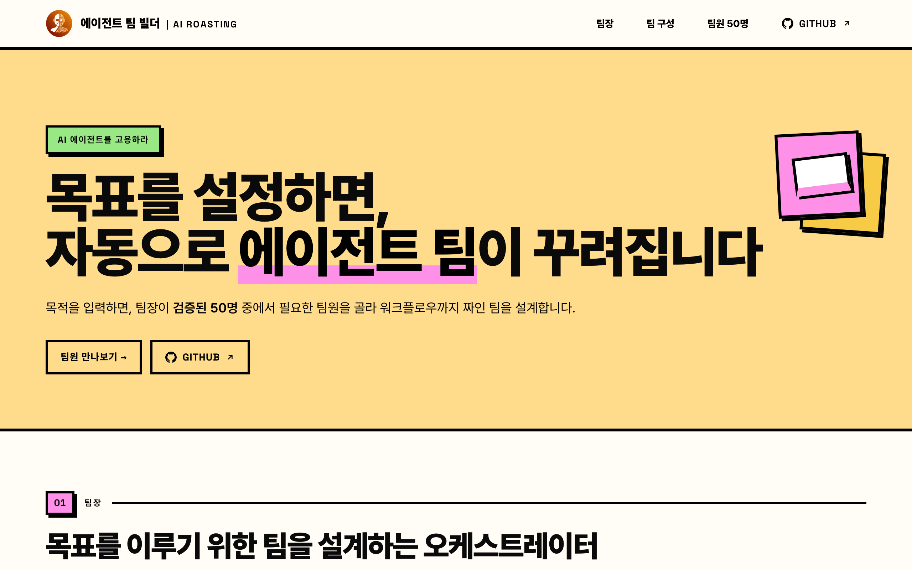

# Casting · 에이전트 팀 빌더 (실행 엔진)


[](https://50agents.vercel.app)

[](https://50agents.vercel.app)

> 목적 한 줄을 받아, 검증된 50명 에이전트 팀원 중에서 팀을 설계하고 **실제로 돌려** 검토 통과본까지 만들어 내는 Claude Code 스킬입니다.

**라이브 데모**: [50agents.vercel.app](https://50agents.vercel.app) — 50명 팀원 카탈로그와 팀 빌더를 브라우저에서 바로 볼 수 있습니다.

`AI ROASTING`이 로스팅(5색 다관점 채점)으로 검증한 50개 역할 프롬프트와 28개 검증된 팀 레시피를 기반으로, 사용자가 "무엇을 만들지(목적)"만 말하면 팀장(오케스트레이터)이 "누가 어떤 순서로 하는지"를 정하고 끝까지 진행합니다.

**기본(네이티브) 플랫폼은 Claude Code입니다.** 독립 에이전트로 팀을 돌리고 검토자도 진짜 독립이라 9.5 게이트가 가장 강하게 작동합니다. [ChatGPT는 호환 모드로도 쓸 수 있습니다](#chatgpt에서-쓰기)(단일 모델 순차 실행).

## 무엇을 하나

목적 입력 → ① 목적 파악 → ② 팀 설계 → ③ 팀 구조 제시 → ④ 실행 → ⑤ 검토(9.5 게이트) → 최종 결과.

- **부품(Agent)** 50개 = 단일 역할 시스템 프롬프트. 전부 9.5+ 합격선으로 로스팅 검증.
- **레시피(Harness)** 28개 = 부품을 handoff로 엮은 검증된 팀(리서치 보고서·시장 분석·재무 리뷰·발표자료·전략·회의 정리 등).
- **라우터** = 목적 → 레시피 매칭 또는 부품 새 조합. 이것이 핵심 IP입니다.

## 팀원 50명 (부품 카탈로그)

목적에 따라 아래 50개 역할 중에서 팀이 꾸려집니다. 8개 섹션으로 나뉩니다.

### 1. 리서치·정보
| # | 직책 | English | 하는 일 |
|---|---|---|---|
| 1 | 리서치 어시스턴트 | Research Assistant | 주제를 조사해 핵심을 정리합니다 |
| 2 | 팩트체커 | Fact Checker | 주장과 수치의 사실 여부를 검증합니다 |
| 3 | 마켓 리서처 | Market Researcher | 시장과 산업 동향을 조사합니다 |
| 4 | 경쟁·동향 분석가 | Competitor Analyst | 경쟁·유사 사례를 분석합니다 |
| 5 | 문헌 정리 담당 | Literature Reviewer | 자료와 논문을 요약 정리합니다 |
| 6 | 인터뷰 설계자 | Interview Designer | 인터뷰 질문을 설계합니다 |
| 7 | 출처 검증 담당 | Source Verifier | 출처의 신뢰도를 점검합니다 |

### 2. 분석·인사이트
| # | 직책 | English | 하는 일 |
|---|---|---|---|
| 8 | 데이터 분석가 | Data Analyst | 데이터에서 패턴과 인사이트를 찾습니다 |
| 9 | 트렌드 분석가 | Trend Analyst | 떠오르는 흐름을 포착합니다 |
| 10 | 설문 분석가 | Survey Analyst | 설문과 피드백을 분석합니다 |
| 11 | 리스크 분석가 | Risk Analyst | 위험 요인을 식별하고 평가합니다 |
| 12 | 의사결정 도우미 | Decision Helper | 선택지를 비교하고 근거를 정리합니다 |
| 13 | SWOT 분석가 | SWOT Analyst | 강·약점과 기회·위협을 정리합니다 |

### 3. 재무·숫자
| # | 직책 | English | 하는 일 |
|---|---|---|---|
| 14 | 재무 분석가 | Financial Analyst | 재무제표를 읽고 해석합니다 |
| 15 | 예산 관리 담당 | Budget Manager | 예산을 편성하고 점검합니다 |
| 16 | 비용 분석가 | Cost Analyst | 비용 구조를 분석합니다 |
| 17 | IR·투자자 리포트 담당 | Investor Reporter | 투자자·이사회용 보고를 작성합니다 |
| 18 | KPI 추적 담당 | KPI Tracker | 핵심 지표를 추적하고 정리합니다 |
| 19 | 재무 모델러 | Financial Modeler | 시나리오와 전망을 모델링합니다 |

### 4. 글쓰기·문서
| # | 직책 | English | 하는 일 |
|---|---|---|---|
| 20 | 보고서 작성가 | Report Writer | 보고서 초안을 작성합니다 |
| 21 | 이메일 작성 담당 | Email Drafter | 업무 이메일을 작성합니다 |
| 22 | 요약 담당 | Summarizer | 긴 문서를 핵심만 요약합니다 |
| 23 | 제안서 작성가 | Proposal Writer | 제안서를 작성합니다 |
| 24 | 프레젠테이션 기획자 | Deck Planner | 슬라이드 구성을 짭니다 |
| 25 | 교정·윤문 담당 | Copy Editor | 문장을 다듬고 교정합니다 |
| 26 | 정부지원사업 작성가 | Grant Writer | 지원사업·보조금 양식에 맞춰 작성합니다 |
| 27 | 번역 담당 | Translator | 번역하고 자연스럽게 다듬습니다 |

### 5. 커뮤니케이션
| # | 직책 | English | 하는 일 |
|---|---|---|---|
| 28 | 회의록 작성 담당 | Meeting Notetaker | 회의 내용을 정리합니다 |
| 29 | 고객 응대 담당 | Customer Support | 문의와 클레임에 답변을 작성합니다 |
| 30 | 사내 공지 담당 | Internal Comms | 사내 공지를 작성합니다 |
| 31 | 발표 스크립트 작성가 | Speech Writer | 발표·연설문을 씁니다 |
| 32 | 협상 준비 담당 | Negotiation Prep | 협상 시나리오를 준비합니다 |
| 33 | 피드백 종합 담당 | Feedback Synthesizer | 흩어진 의견을 종합합니다 |

### 6. 기획·전략
| # | 직책 | English | 하는 일 |
|---|---|---|---|
| 34 | 전략 기획자 | Strategy Planner | 전략 옵션을 정리합니다 |
| 35 | 프로젝트 기획자 | Project Planner | 프로젝트 계획과 일정을 짭니다 |
| 36 | 목표·OKR 설계자 | OKR Designer | 목표와 OKR을 설계합니다 |
| 37 | 제품 기획자 | Product Manager | 요구사항과 스펙을 PRD로 정리합니다 |
| 38 | 브레인스토밍 파트너 | Brainstorm Partner | 아이디어를 함께 발산합니다 |
| 39 | 비즈니스 케이스 작성가 | Business Case Writer | 사업 타당성을 정리합니다 |

### 7. 생산성·자동화
| # | 직책 | English | 하는 일 |
|---|---|---|---|
| 40 | 일정 관리 담당 | Scheduler | 일정을 조율하고 정리합니다 |
| 41 | 업무 정리 담당 | Task Organizer | 할 일을 관리합니다 |
| 42 | 받은편지함 관리 담당 | Inbox Manager | 메일을 분류하고 응대합니다 |
| 43 | 채용 담당 | Recruiter | 채용 공고와 면접 질문을 준비합니다 |
| 44 | SOP 작성가 | SOP Writer | 표준 업무 절차를 문서화합니다 |
| 45 | 자동화 설계자 | Automation Designer | 반복 업무를 자동화합니다 |

### 8. 검토·품질
| # | 직책 | English | 하는 일 |
|---|---|---|---|
| 46 | 문서 검토 담당 | Document Reviewer | 계약과 문서를 검토합니다 |
| 47 | 품질 검수 담당 | Quality Checker | 산출물의 품질을 검수합니다 |
| 48 | 개념 설명가 | Explainer | 어려운 개념을 쉽게 풀어 줍니다 |
| 49 | 비판적 검토자 | Devil's Advocate | 결론을 반박해 약점을 찾습니다 |
| 50 | 리포트 자동화 담당 | Reporting Automator | 정기 리포트를 생성합니다 |

> 팀장(오케스트레이터)은 이 50명과 별개입니다. 위 부품을 골라 순서를 정하고 실행·검토를 지휘하는 라우터 역할입니다.

## 설치

이 저장소를 클론한 뒤, 스킬 파일을 Claude Code 스킬 폴더로 복사합니다(저장소 루트에는 스킬 파일과 함께 데모 웹사이트 `index.html`·`assets/`도 있으므로, 스킬 구성 파일만 골라 복사합니다).

```bash
git clone https://github.com/airoasting/casting.git
# 모든 프로젝트에서 쓰려면 사용자 레벨(~/.claude/skills)
mkdir -p ~/.claude/skills/casting
cp -r casting/{SKILL.md,README.md,LICENSE,references,platforms} ~/.claude/skills/casting/
```

특정 프로젝트에서만 쓰려면 `~/.claude/skills/casting` 대신 `<your-project>/.claude/skills/casting`으로 복사합니다. Claude Code를 재시작하면 스킬이 로드되고, `/casting`으로 발동합니다.

## 사용법

```
/casting 경쟁사 3곳을 분석해서 이사회용 보고서 만들어줘
```

또는 "팀 짜줘", "이거 팀으로 해줘", 혹은 보고서·분석·발표자료·제안서·재무검토·회의정리 같은 결과물을 "만들어 달라"고 하면 발동합니다. 어떤 팀원이 필요한지 몰라도 목적만 주면 됩니다.

## 실행 모드 (티어드)

쓸 수 있는 도구에 따라 위에서부터 고릅니다.

1. **에이전트 팀**: `TeamCreate`/`SendMessage`/`TaskCreate` 가능 시. 팀원이 공유 작업목록으로 자체 조율.
2. **서브에이전트**: `Agent` 도구만 있으면. 의존 단계는 파이프라인, 독립 단계는 병렬(fan-out). (기본·안정)
3. **순차 역할극**: 에이전트 도구가 없으면 팀장이 직접 역할을 순서대로 수행. (폴백)

핵심은 팀원이 **각자 독립 컨텍스트**라는 점입니다. 그래서 (a) 검토자가 진짜 독립이라 9.5 게이트가 자기채점이 아니고, (b) 독립 단계를 병렬로 돌립니다.

## 품질 게이트

검토자는 산출물을 만들지 않은 **독립 에이전트**로, 사용자의 원래 목적·자료에 대고 구체적 결함부터 찾습니다. 결함이 하나라도 있으면 9.5를 주지 않고, 그 단계로 한 번 되돌려 보강한 뒤 통과시킵니다. (실측 테스트에서 게이트가 첫 통과를 거부하고 6.5로 불합격 처리한 뒤 보강을 요구했습니다. 통과를 거저 주지 않는, 실제로 떨어지는 게이트입니다.)

## 실행 결과 (워크스페이스)

Claude Code에서 실행하면, 그 실행의 팀과 산출물이 파일로 남습니다.

```
_workspace/
└── 20260628_01/             # {YYYYMMDD}_NN, 같은 날 재호출 시 _02·_03
    ├── team.md              # 빌드 시트: 목적·팀 구조·순서·토글
    ├── lead/                # 팀장(오케스트레이터)
    │   └── lead.md
    ├── agents/              # 배치된 팀원(역할 프롬프트 + 이번 io)
    │   ├── 1-research-assistant.md
    │   ├── 2-summarizer.md
    │   └── review-copy-editor.md
    └── output/              # 단계별 산출물 + 최종결과.md
```

팀이 일회성으로 사라지지 않고 자산으로 남아, 다시 보거나 재사용할 수 있습니다. (ChatGPT 호환 모드는 파일시스템이 없어 팀·산출물을 화면 인라인으로만 보여 줍니다.)

## ChatGPT에서 쓰기 (호환 모드)

기본은 Claude Code지만, **ChatGPT(Custom GPT)** 로도 같은 동작을 쓸 수 있습니다. `platforms/chatgpt/`에 셋업이 있습니다.

- `platforms/chatgpt/INSTRUCTIONS.md` — Custom GPT "Instructions"에 붙여 넣을 본문
- `platforms/chatgpt/SETUP.md` — 5분 셋업(Instructions 붙여넣기 + `references/` 4개를 Knowledge로 업로드 + 브라우징 켜기)

ChatGPT엔 서브에이전트가 없어 실행은 **단일 모델 순차 모드**(스킬의 폴백 모드)로, 게이트는 "냉정 재독" 독립 검토로 동작합니다. 검증된 50 부품·28 레시피·9.5 게이트는 동일합니다.

## 장착 도구

일부 팀원은 AI ROASTING 자사 도구를 역할별로 쥐고 있습니다.

| 도구 | 용도 | 받는 팀원 |
|---|---|---|
| [전략 도구 갤러리](https://airoasting-strategy.vercel.app/) | 70개 컨설팅 프레임워크 | 전략 기획·SWOT·비즈니스 케이스·의사결정 |
| [5color](https://5color.vercel.app/) | 5인 페르소나 검토 지침 생성 | 품질 검수·비판적 검토·문서 검토·교정 |
| [슬라이드 라이브러리](https://airoasting-slide.vercel.app/) | 35개 HTML 슬라이드 템플릿 | 프레젠테이션 기획·제안서 |
| [AI ROASTING 블로그](https://airoasting-blog.vercel.app/) | 글로벌 리서치 인사이트 | 리서치·트렌드·마켓 |
| [Hound](https://github.com/airoasting/hound) | 16개 채널 끈질긴 다채널 검색 | 리서치·팩트체크·마켓·경쟁분석·출처검증 |
| [스킬 라이브러리](https://airoasting-skill.vercel.app/) | 엄선된 실무 AI 스킬 | 자동화 설계·SOP |

## 구조

저장소 루트에 스킬 구성 파일이 있습니다(에이전트 팀 빌더 데모 웹사이트 `index.html`·`assets/`와 같은 루트를 공유합니다).

```
SKILL.md                   # 트리거 · 라우터 결정 사다리 · 실행 프로토콜 · 9.5 게이트
README.md                  # 이 문서
LICENSE                    # Apache License 2.0
references/
├── catalog.md             # 50명 부품 표(선발용)
├── harnesses.md           # 28 레시피 + 라우터 결정 사다리 + 토글
├── agent-prompts.md       # 50명 전체 시스템 프롬프트(실행용, id 구간으로 선택)
└── execution-modes.md     # 실행 모드 3종 · 실제 도구 호출 문법 · 검토자 템플릿
platforms/
└── chatgpt/
    ├── INSTRUCTIONS.md    # Custom GPT Instructions 본문
    └── SETUP.md           # ChatGPT 셋업 가이드
```

## 라이선스

Copyright 2026 AI ROASTING (Jayden Kang). [Apache License 2.0](./LICENSE) 하에 배포됩니다.
