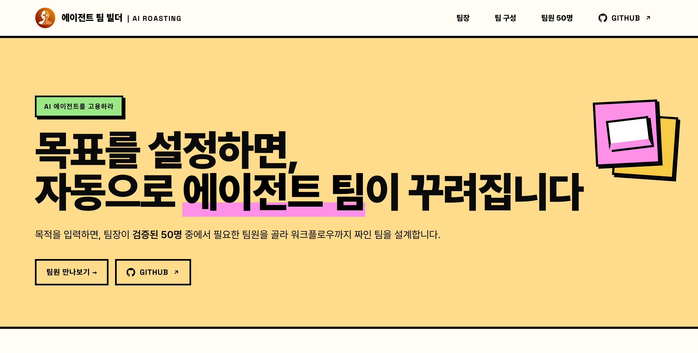

# Casting · 에이전트 팀 빌더 (실행 엔진)


[](https://50agents.vercel.app)

[](https://50agents.vercel.app)

> 목적 한 줄을 받아, 검증된 50명 에이전트 팀원 중에서 팀을 설계하고 **실제로 돌려** 검토 통과본까지 만들어 내는 Claude Code 스킬입니다.
>
> **v1.1.0 (2026-07-12)** · 회사형 10개 본부로 개편. 디자인·마케팅·법무·감사·인사 직군 신설, 디자인은 실제 이미지 산출(gpt-image + OpenAI API).

**라이브 데모**: [50agents.vercel.app](https://50agents.vercel.app) — 50명 팀원 카탈로그와 팀 빌더를 브라우저에서 바로 볼 수 있습니다.

`AI ROASTING`이 로스팅(5색 다관점 채점)으로 검증한 50개 역할 프롬프트와 28개 검증된 팀 레시피를 기반으로, 사용자가 "무엇을 만들지(목적)"만 말하면 팀장(오케스트레이터)이 "누가 어떤 순서로 하는지"를 정하고 끝까지 진행합니다.

**기본(네이티브) 플랫폼은 Claude Code입니다.** 독립 에이전트로 팀을 돌리고 검토자도 진짜 독립이라 9.5 게이트가 가장 강하게 작동합니다. [ChatGPT는 호환 모드로도 쓸 수 있습니다](#chatgpt에서-쓰기)(단일 모델 순차 실행).

## 무엇을 하나

목적 입력 → ① 목적 파악 → ② 팀 설계 → ③ 팀 구조 제시 → ④ 실행 → ⑤ 검토(9.5 게이트) → 최종 결과.

- **부품(Agent)** 50개 = 단일 역할 시스템 프롬프트. 전부 9.5+ 합격선으로 로스팅 검증.
- **레시피(Harness)** 28개 = 부품을 handoff로 엮은 검증된 팀(리서치 보고서·시장 분석·재무 리뷰·발표자료·전략·회의 정리 등).
- **라우터** = 목적 → 레시피 매칭 또는 부품 새 조합. 이것이 핵심 IP입니다.

## 팀원 50명 (부품 카탈로그)

목적에 따라 아래 50개 역할 중에서 팀이 꾸려집니다. 회사형 **10개 본부**로 나뉩니다.

### 1. 전략기획실
| # | 직책 | English | 하는 일 |
|---|---|---|---|
| 1 | 경영전략가 | Management Strategist | 전사·경쟁 전략과 시장 포지셔닝을 설계합니다 |
| 2 | 신규사업 개발 | New Business Developer | 신사업 기회를 발굴하고 사업모델을 설계합니다 |
| 3 | 사업 타당성 분석가 | Feasibility Analyst | 수익성·리스크로 사업 타당성을 검증합니다 |
| 4 | 제품 기획자 | Product Manager | 요구사항과 로드맵을 PRD로 정리합니다 |
| 5 | 프로젝트·목표 기획자 | Project & OKR Planner | 실행 계획·일정·OKR을 설계합니다 |

### 2. 리서치랩
| # | 직책 | English | 하는 일 |
|---|---|---|---|
| 6 | 리서치 어시스턴트 | Research Assistant | 주제를 조사해 핵심을 정리합니다 |
| 7 | 팩트·출처 검증가 | Fact & Source Checker | 주장·수치의 사실과 출처를 검증합니다 |
| 8 | 마켓 리서처 | Market Researcher | 시장과 산업 동향을 조사합니다 |
| 9 | 경쟁·동향 분석가 | Competitor Analyst | 경쟁·유사 사례를 분석합니다 |
| 10 | 데이터 분석가 | Data Analyst | 데이터에서 패턴과 인사이트를 찾습니다 |
| 11 | 트렌드·인사이트 분석가 | Trend & Insight Analyst | 흐름과 인사이트를 짚어냅니다 |

### 3. 재무본부
| # | 직책 | English | 하는 일 |
|---|---|---|---|
| 12 | 재무 분석가 | Financial Analyst | 재무제표를 읽고 시나리오를 모델링합니다 |
| 13 | 예산·비용 관리 | Budget & Cost Manager | 예산을 편성하고 비용 구조를 봅니다 |
| 14 | IR·투자자 리포트 | Investor Reporter | 투자자·이사회용 보고를 작성합니다 |
| 15 | KPI 추적 | KPI Tracker | 핵심 지표를 추적하고 정리합니다 |
| 16 | 리스크 분석가 | Risk Analyst | 재무·사업 위험을 식별하고 평가합니다 |
| 17 | 회계사 | Certified Accountant | 세무·회계 처리를 돕습니다 (자문 아님) |

### 4. 마케팅본부
| # | 직책 | English | 하는 일 |
|---|---|---|---|
| 18 | 콘텐츠 마케터 | Content Marketer | 오가닉 콘텐츠 주제와 서사를 기획합니다 |
| 19 | SEO·GEO 전략가 | SEO & GEO Strategist | 검색·AI 노출을 최적화합니다 |
| 20 | 소셜미디어 전략가 | Social Media Strategist | 채널 운영과 콘텐츠 캘린더를 짭니다 |
| 21 | 퍼포먼스·광고 전략가 | Performance Ad Strategist | 유료 광고와 전환을 설계합니다 |
| 22 | 카피라이터 | Copywriter | 광고·세일즈 카피를 벼립니다 |
| 23 | 이메일·CRM 마케터 | Email & CRM Marketer | 뉴스레터·리텐션을 설계합니다 |
| 24 | VOC·설문 분석가 | VOC & Survey Analyst | 고객의 목소리와 설문을 분석합니다 |

### 5. 디자인본부
| # | 직책 | English | 하는 일 |
|---|---|---|---|
| 25 | 슬라이드 디자이너 | Slide Designer | 발표 슬라이드 비주얼을 생성합니다 |
| 26 | 인포그래픽·차트 디자이너 | Infographic Designer | 데이터를 시각화합니다 |
| 27 | 카드뉴스 제작자 | Card News Creator | SNS 카드뉴스를 만듭니다 |
| 28 | 브랜드·비주얼 가디언 | Brand & Visual Guardian | 톤·아이덴티티와 비주얼을 지킵니다 |
| 29 | 이미지 생성 | Image Generator | 필요한 이미지를 생성합니다 |
> 디자인본부 5명은 gpt-image 스킬로 프롬프트를 만들고 OpenAI 이미지 API로 실제 이미지를 산출합니다(키 없으면 완성 프롬프트로 폴백).

### 6. 콘텐츠제작본부
| # | 직책 | English | 하는 일 |
|---|---|---|---|
| 30 | 보고서 작성가 | Report Writer | 보고서 초안을 작성합니다 |
| 31 | 제안서·지원사업 작성가 | Proposal & Grant Writer | 제안서·지원사업 양식을 작성합니다 |
| 32 | 이메일·업무 서신 작성 | Business Correspondence Writer | 업무 이메일과 서신을 작성합니다 |
| 33 | 요약·브리핑 담당 | Summarizer | 긴 문서를 핵심만 요약합니다 |
| 34 | 교정·윤문 담당 | Copy Editor | 문장을 다듬고 교정합니다 |
| 35 | 번역·현지화 담당 | Translator | 번역하고 자연스럽게 다듬습니다 |

### 7. 커뮤니케이션·PR본부
| # | 직책 | English | 하는 일 |
|---|---|---|---|
| 36 | PR·언론 홍보 | PR & Media Relations | 보도자료와 미디어 대응을 맡습니다 |
| 37 | 대외 응대 | Customer Response | 문의와 클레임에 답변을 작성합니다 |
| 38 | 사내 커뮤니케이션 | Internal Comms | 사내 공지와 안내를 작성합니다 |
| 39 | 발표·스피치 작성 | Speech Writer | 발표·연설문을 씁니다 |
| 40 | 협상·이해관계자 대응 | Negotiation & Stakeholder | 협상 시나리오를 준비합니다 |

### 8. 인사본부
| # | 직책 | English | 하는 일 |
|---|---|---|---|
| 41 | 채용 담당 | Recruiter | 채용 공고와 면접 질문을 준비합니다 |
| 42 | 노무사 | Labor Attorney | 인사·근로·노무를 돕습니다 (자문 아님) |
| 43 | 성과·보상 설계 | Comp & Performance Designer | 평가·보상 제도를 설계합니다 |

### 9. 법무·감사본부
| # | 직책 | English | 하는 일 |
|---|---|---|---|
| 44 | 변호사 | Legal Counsel | 계약·법률 리스크를 검토합니다 (자문 아님) |
| 45 | 감사인 | Auditor | 내부감사·준법·통제를 점검합니다 (자문 아님) |
| 46 | 문서·품질 검수 | Document & Quality Reviewer | 계약·문서·산출물을 검수합니다 |
| 47 | 비판적 검토자 | Devil's Advocate | 결론을 반박해 약점을 찾습니다 |
> 회계사·변호사·감사인·노무사는 실무 초안·1차 검토 보조이며 법률·세무·노무 자문이 아닙니다. 최종 판단은 자격 전문가 확인이 필요합니다.

### 10. 운영자동화본부
| # | 직책 | English | 하는 일 |
|---|---|---|---|
| 48 | SOP·프로세스 | SOP & Process Designer | 표준 업무 절차를 문서화합니다 |
| 49 | 자동화 아키텍트 | Automation Architect | 반복 업무·리포트를 자동화합니다 |
| 50 | 업무·일정 오케스트레이션 | Work & Schedule Orchestrator | 일정·할일·메일을 조율합니다 |

> 팀장(오케스트레이터)은 이 50명과 별개입니다. 위 부품을 골라 순서를 정하고 실행·검토를 지휘하는 라우터 역할입니다.

## 설치

이 저장소를 클론한 뒤, 스킬 파일을 Claude Code 스킬 폴더로 복사합니다(저장소 루트에는 스킬 파일과 함께 데모 웹사이트 `index.html`·`assets/`도 있으므로, 스킬 구성 파일만 골라 복사합니다).

```bash
git clone https://github.com/airoasting/casting.git
# 모든 프로젝트에서 쓰려면 사용자 레벨(~/.claude/skills)
mkdir -p ~/.claude/skills/casting
cp -r casting/{SKILL.md,README.md,LICENSE,references,platforms} ~/.claude/skills/casting/
```

특정 프로젝트에서만 쓰려면 `~/.claude/skills/casting` 대신 `<your-project>/.claude/skills/casting`으로 복사합니다. Claude Code를 재시작하면 스킬이 로드되고, `/casting`으로 발동합니다.

## 사용법

```
/casting 경쟁사 3곳을 분석해서 이사회용 보고서 만들어줘
```

또는 "팀 짜줘", "이거 팀으로 해줘", 혹은 보고서·분석·발표자료·제안서·재무검토·회의정리 같은 결과물을 "만들어 달라"고 하면 발동합니다. 어떤 팀원이 필요한지 몰라도 목적만 주면 됩니다.

## 실행 모드 (티어드)

쓸 수 있는 도구에 따라 위에서부터 고릅니다.

1. **에이전트 팀**: `TeamCreate`/`SendMessage`/`TaskCreate` 가능 시. 팀원이 공유 작업목록으로 자체 조율.
2. **서브에이전트**: `Agent` 도구만 있으면. 의존 단계는 파이프라인, 독립 단계는 병렬(fan-out). (기본·안정)
3. **순차 역할극**: 에이전트 도구가 없으면 팀장이 직접 역할을 순서대로 수행. (폴백)

핵심은 팀원이 **각자 독립 컨텍스트**라는 점입니다. 그래서 (a) 검토자가 진짜 독립이라 9.5 게이트가 자기채점이 아니고, (b) 독립 단계를 병렬로 돌립니다.

## 품질 게이트

검토자는 산출물을 만들지 않은 **독립 에이전트**로, 사용자의 원래 목적·자료에 대고 구체적 결함부터 찾습니다. 결함이 하나라도 있으면 9.5를 주지 않고, 그 단계로 한 번 되돌려 보강한 뒤 통과시킵니다. (실측 테스트에서 게이트가 첫 통과를 거부하고 6.5로 불합격 처리한 뒤 보강을 요구했습니다. 통과를 거저 주지 않는, 실제로 떨어지는 게이트입니다.)

## 실행 결과 (워크스페이스)

Claude Code에서 실행하면, 그 실행의 팀과 산출물이 파일로 남습니다.

```
_workspace/
└── 20260628_01/             # {YYYYMMDD}_NN, 같은 날 재호출 시 _02·_03
    ├── team.md              # 빌드 시트: 목적·팀 구조·순서·토글
    ├── lead/                # 팀장(오케스트레이터)
    │   └── lead.md
    ├── agents/              # 배치된 팀원(역할 프롬프트 + 이번 io)
    │   ├── 1-research-assistant.md
    │   ├── 2-summarizer.md
    │   └── review-copy-editor.md
    └── output/              # 단계별 산출물 + 최종결과.md
```

팀이 일회성으로 사라지지 않고 자산으로 남아, 다시 보거나 재사용할 수 있습니다. (ChatGPT 호환 모드는 파일시스템이 없어 팀·산출물을 화면 인라인으로만 보여 줍니다.)

## ChatGPT에서 쓰기 (호환 모드)

기본은 Claude Code지만, **ChatGPT(Custom GPT)** 로도 같은 동작을 쓸 수 있습니다. `platforms/chatgpt/`에 셋업이 있습니다.

- `platforms/chatgpt/INSTRUCTIONS.md` — Custom GPT "Instructions"에 붙여 넣을 본문
- `platforms/chatgpt/SETUP.md` — 5분 셋업(Instructions 붙여넣기 + `references/` 4개를 Knowledge로 업로드 + 브라우징 켜기)

ChatGPT엔 서브에이전트가 없어 실행은 **단일 모델 순차 모드**(스킬의 폴백 모드)로, 게이트는 "냉정 재독" 독립 검토로 동작합니다. 검증된 50 부품·28 레시피·9.5 게이트는 동일합니다.

## 장착 도구

일부 팀원은 AI ROASTING 자사 도구를 역할별로 쥐고 있습니다.

| 도구 | 용도 | 받는 팀원 |
|---|---|---|
| [전략 도구 갤러리](https://airoasting-strategy.vercel.app/) | 70개 컨설팅 프레임워크 | 경영전략·신규사업·사업 타당성 |
| [5color](https://5color.vercel.app/) | 5인 페르소나 검토 지침 생성 | 문서·품질 검수·비판적 검토·교정 |
| [슬라이드 라이브러리](https://airoasting-slide.vercel.app/) | 35개 HTML 슬라이드 템플릿 | 슬라이드 디자인·제안서 |
| [AI ROASTING 블로그](https://airoasting-blog.vercel.app/) | 글로벌 리서치 인사이트 | 리서치·트렌드·마켓 |
| [Hound](https://github.com/airoasting/hound) | 16개 채널 끈질긴 다채널 검색 | 리서치·팩트체크·마켓·경쟁분석·출처검증 |
| [스킬 라이브러리](https://airoasting-skill.vercel.app/) | 엄선된 실무 AI 스킬 | 자동화 아키텍트·SOP |

## 구조

저장소 루트에 스킬 구성 파일이 있고, 에이전트 팀 빌더 데모 웹사이트는 `docs/`(GitHub Pages)에 있습니다.

```
SKILL.md                   # 트리거 · 라우터 결정 사다리 · 실행 프로토콜 · 9.5 게이트
README.md                  # 이 문서
LICENSE                    # Apache License 2.0
references/
├── catalog.md             # 50명 부품 표(선발용)
├── harnesses.md           # 28 레시피 + 라우터 결정 사다리 + 토글
├── agent-prompts.md       # 50명 전체 시스템 프롬프트(실행용, id 구간으로 선택)
└── execution-modes.md     # 실행 모드 3종 · 실제 도구 호출 문법 · 검토자 템플릿
platforms/
└── chatgpt/
    ├── INSTRUCTIONS.md    # Custom GPT Instructions 본문
    └── SETUP.md           # ChatGPT 셋업 가이드
docs/                      # GitHub Pages 데모 웹사이트
├── index.html            # 팀 빌더 · 50명 카탈로그
└── assets/               # prompts.js · router.js · agents · logos · thumbnail
```

## 라이선스

Copyright 2026 AI ROASTING (Jayden Kang). [Apache License 2.0](./LICENSE) 하에 배포됩니다.
